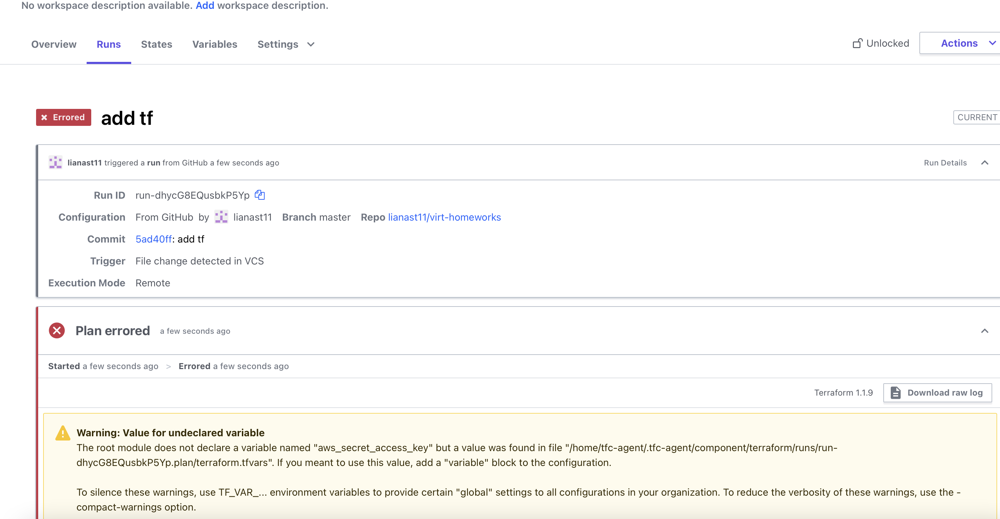

Задача 1. Terraform Clouds  
Я настроила репозиторий в терраформ клауд, триггеры бы сработали, но почему-то выдавалась ошибка аутентификации в aws, хотя в переменные я добавила ключи аутентификации, которые на моем компе работают. Я пыталась разобраться, но пока безуспешно.  
  

Задача 2. Atlantis  
[server.yaml](https://github.com/lianast11/devops-netology/blob/main/terraform/command_work/server.yaml) [atlantis.yaml](https://github.com/lianast11/devops-netology/blob/main/terraform/command_work/atlantis.yaml)  

Задача 3. Модули  

